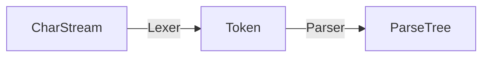

# antlr-demo

下载并设置

```sh

wget https://www.antlr.org/download/antlr-4.8-complete.jar
mv antlr-4.8-complete.jar lib/
```

设置

```sh
source antlr.rc
```

## Hello

```sh
cd hello/
antlr4 Hello.g  # generate Hello*.java
javac Hello*.java
```

使用 grun（要额外输入要解析的文本）

```sh
grun Hello s -tokens   # 输出 token
grun Hello s -tree     # 输出 文本树
grun Hello s -gui      # 输出 图形树
```

基本概念



